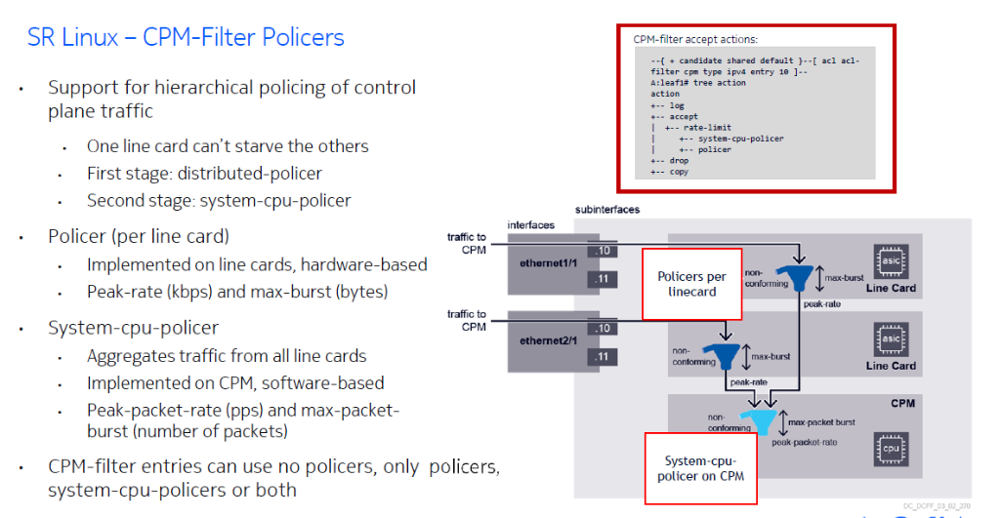
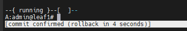

# SRLinux to EDA Converter

A sleek, native desktop utility to automatically convert SRLinux ACL configurations (Info Flat & JSON) into Nokia EDA ControlPlaneFilter CRD YAML.

## Features

- **Painless Conversion**: Simply paste your `set / acl cpm-filter ...` commands or JSON outputs directly from your SRLinux nodes.
- **Dynamic Configuration**: Automatically maps system CPU policer values (peak rate, burst size).
- **Settings Panel**: Tweak your namespace and fallback default values right from the UI.
- **Glassmorphism UI**: A beautiful, modern interface with dark mode and smooth animations.
- **Standalone Executable**: Run it instantly without needing to install Node.js, Python, or a Web Server.

## Screenshots

**Modern User Interface:**


**Smart Conversions with Detailed Error Checking:**


## Getting Started

You do not need to build anything to use the converter!

1. Download the standalone executable from the `releases/` folder in this repository: [SRLinux-to-EDA-Converter.exe](releases/SRLinux-to-EDA-Converter.exe)
2. Double click the `.exe` file on your Windows machine to launch the application.
3. Paste your SRLinux ACL configurations on the left side and instantly retrieve your EDA YAML on the right side!

## Development

If you want to modify or build the application from source:

1. The frontend logic is located in the `converter-app/` and `converter-app-electron/` directories.
2. The UI is built with plain HTML/JS/CSS to remain as lightweight as possible.
3. The executable wrapper is built using Python, `pywebview`, and `pyinstaller`.

### Rebuilding the Executable

Make sure you have Python 3 installed, then install the required dependencies:
```cmd
pip install pyinstaller pywebview
```

Navigate to `converter-app-electron` and build:
```cmd
pyinstaller --noconsole --onefile --add-data "index.html;." --add-data "app.js;." --add-data "parser.js;." --add-data "mapper.js;." --add-data "generator.js;." --add-data "styles.css;." main.py -n "SRLinux-to-EDA-Converter" -y
```